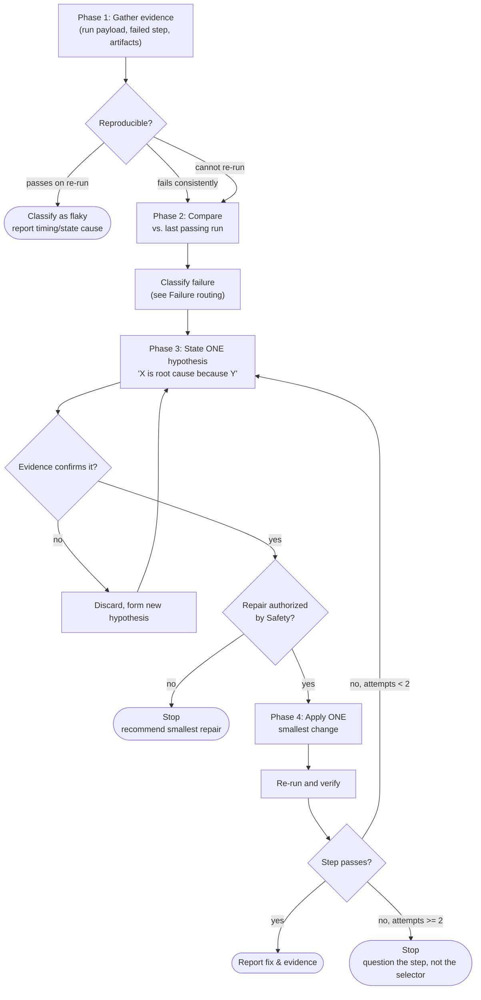

# BugBug Test Run Debugging

## Preflight

1. Run `bugbug-context-discovering` before inspecting or repairing test runs.
2. If a repair may change DOM-targeted steps, load
   `bugbug-selectors-authoring`.
3. Confirm the project, test run, test, or step run context before diagnosis.

## Inputs

Resolve at least one of:

- `testRunId` (preferred) to inspect a specific run.
- `testId` to inspect the latest run for that test.
- `stepRunId` to focus on a specific step run within the selected run.

## Safety

**The iron law: no repair without run evidence first.** A failed step tells you
*where* the run stopped, not *why*. Until Phases 1 and 2 of the `Workflow` are
complete, do not propose or apply a repair. Rewriting a selector because a step
failed on a selector is a symptom fix.

- Do not debug suite runs with this skill. Use test-level runs only.
- Do not start a new run just because a `testId` was provided. Inspect the latest
  run first.
- Do not mutate a test unless the user explicitly requests the specific repair.
- Treat `stepRunId` as an optional focus, not a required failure identifier.
- Stop after two failed repairs on the same step. Question the step instead.
- Stop when no project, test, run, or step evidence can be confirmed. Ask for the
  missing identifier or selection instead of guessing.

## Workflow

Complete each phase before starting the next.

### Phase 1: Gather evidence

1. Inspect the provided run with `bugbug_get_test_run`. If only `testId` is
   available, find its latest run with `bugbug_list_test_runs` first.
2. Treat the returned run payload as the default evidence source. Follow its
   artifact and screenshot links only when more evidence is needed. Never
   construct run resource URIs manually.
3. Read the error code and message on the failed step before forming any opinion.
   The code (`ELEMENT_DOES_NOT_EXIST`, `FAILED_WAITING_CONDITIONS`, and similar)
   already narrows the routing.
4. Focus on the failed step with `bugbug_get_failed_step_run_details`.
5. Establish reproducibility. Check earlier runs of the same test: does this step
   fail every time, or intermittently? An intermittently failing step is a timing
   or state problem, and repairing its selector will not fix it.

### Phase 2: Compare against a passing run

1. Find the most recent passing run of the same test with
   `bugbug_list_test_runs` (filter by `status=passed`).
2. Compare the failed step against its last passing execution: selector used,
   waiting conditions, resolved variables, and page state.
3. List every difference before deciding which one matters. Do not assume a
   difference is irrelevant because it looks cosmetic.
4. Check what changed around the run: app deployment, test edits, profile or
   variable changes, environment.
5. Classify the failure using **Failure routing** below.

### Phase 3: Form one hypothesis

1. State it explicitly: "I think X is the root cause because Y." Name the
   evidence Y refers to.
2. Verify the hypothesis against the DOM snapshot, screenshots, or run logs
   before touching the test. `bugbug_query_dom_snapshot_element` confirms whether
   a selector resolves in the captured DOM.
3. If the evidence contradicts the hypothesis, discard it and form a new one. Do
   not stack a second theory on top of the first.
4. If you cannot form an evidence-backed hypothesis, say so and report what
   additional evidence is needed. Do not guess.

### Phase 4: Repair and verify

Only enter this phase when the user has explicitly authorized the specific
repair. Otherwise stop and recommend it.

1. Apply the single smallest change that addresses the confirmed root cause. No
   bundled cleanups, no "while I'm here" edits to neighbouring steps.
2. Validate with a new run and confirm the previously failing step now passes.
3. Confirm no later step broke as a result.
4. If the step still fails, count your attempts:
   - **Fewer than 2 repairs tried**: return to Phase 3 with the new run's
     evidence and form a different hypothesis.
   - **2 or more repairs tried**: stop. Do not attempt another repair.

### After 2 failed repairs: question the step

Repeated failed repairs on the same step usually mean the step itself is wrong,
not its selector. Stop and ask:

- Is this the right step type for the interaction?
- Is a `switchContext` step missing for an iframe, or shadow-host selectors
  missing from the preset?
- Is a required waiting condition missing, or is an active one meaningless for
  this UI state?
- Did an earlier step fail to reach the expected application state, making this
  step unreachable as written?
- Is the test design itself the problem — missing setup, wrong profile, or a flow
  that no longer exists in the product?

Report this to the user as a design question. Do not attempt repair #3.

### Failure routing

- **Selector problem**: Confirm the active selector is broken, compare it with
  the last passing run, and use screenshot plus DOM evidence for replacements.
- **Visual regression**: Compare expected, observed, and diff screenshots; decide
  whether to report a regression or update the baseline.
- **Assertion problem**: Explain expected versus observed behavior and where the
  fix belongs.
- **Waiting conditions problem**: Inspect failed and skipped waiting-condition
  results, then locate the fix in test state, app state, data, environment, or
  waiting-condition configuration.
- **Test data or variables problem**: Identify missing or invalid variables,
  credentials, tenant data, or preconditions. Check whether the variable was
  unresolved, empty, or wrong before repairing the step that visibly failed. Do
  not invent secrets.
- **App or product problem**: Cite the run evidence and report the product
  behavior that changed.
- **Environment problem**: Cite network, console, timeout, region, profile, or
  infrastructure clues.

### Red flags

If you catch yourself thinking any of these, return to Phase 1.

| Thought | Reality |
|---------|---------|
| "The step failed on a selector, so rewrite the selector" | The error code names the symptom. A resolving selector on a wrong page is still a failure. |
| "Just bump the timeout and re-run" | Timeout increases are valid only when evidence shows the condition eventually resolves. |
| "Let me fix these three steps at once" | You cannot tell which change worked, and you may mask a second cause. |
| "It failed once, that's enough to diagnose" | Check reproducibility first. Intermittent failures are timing or state, not selectors. |
| "I'll re-run it and see what happens" | Re-running without a hypothesis is guessing with extra steps. |
| "One more repair attempt" (after 2) | 2+ failures means the step or test design is wrong. Question it instead. |
| "The user will want this other cleanup too" | Repairs are authorized individually. Recommend, don't apply. |

## Output

- Selected test run and failed-step context.
- Triage confidence
- Summary
- Evidence-backed failure classification.
- The hypothesis you confirmed, and the evidence confirming it.
- Affected files, if tested app codebase available
- Smallest proposed solution or next diagnostic action.
- Verification actions
- Explicit blockers, uncertainty, and any repair requiring user confirmation.

## Resources

Resolve bundled resource paths relative to this skill directory.

- Load `bugbug-context-discovering` during Preflight.
- Read `references/selectors-troubleshooting.md` for selector failure diagnosis
  and repair.
- Read `references/assertion-troubleshooting.md` for assertion failure diagnosis
  and repair.
- Read `references/visual-regression-review.md` for screenshot comparison and baseline decisions.
- Read `references/waiting-conditions-results-check.md` for
  `FAILED_WAITING_CONDITIONS` diagnosis and repair decisions.
- Read `references/variables-troubleshooting.md` for unresolved, empty, or wrong
  variable diagnosis, including profile scope and secret placeholders.
- Load `bugbug-selectors-authoring` before changing DOM-targeted steps.
