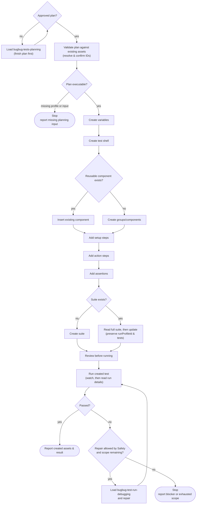

# BugBug Tests Authoring

## Preflight

1. Load `bugbug-tests-planning` before designing tests or reusable assets.
2. Run `bugbug-context-discovering` before creating, editing, running, or
   importing BugBug tests.
3. Load `bugbug-steps-authoring` before materializing steps.
4. Load `bugbug-selectors-authoring` before creating or changing DOM-targeted
   steps.

## Inputs

An approved plan supplies these. Sources are the request itself, existing BugBug
assets, product flow descriptions, and discovered evidence.

- User intent and requested authoring scope.
- Project context and target suite.
- Test name, purpose, owner boundary, and run profile.
- Start URL or target page.
- Existing components, variables, suites, and profiles to reuse.
- New assets to create, if any.
- Step-level flow: setup, user actions, and expected assertions.
- Required credentials or test data source. Never invent secrets.

If any of these is missing and cannot be inferred from existing BugBug assets,
stop and ask for it before creating or mutating tests.

## Safety

- Keep platform mutations within the user's requested authoring scope.
- Do not invent product intent, test data, credentials, secrets, selectors, or
  reusable asset references.
- When repairing a failed authored test, change only behavior covered by the
  original authoring request.
- Stop before creating, editing, running, or importing anything when the target
  project cannot be confirmed.

## Workflow

1. Start from an approved plan. If planning is still needed, load
   `bugbug-tests-planning` and finish the plan before mutating BugBug resources.
2. Create the test shell, groups, steps, and assertions from the approved plan
   by following `The Process`.
3. Run the test with `bugbug_run_test`. Watch it with
   `bugbug_watch_run_progress`, then read details with `bugbug_get_test_run`.
4. If the test fails, load `bugbug-test-run-debugging`, inspect the run, and make
   only repairs allowed by `Safety`.
5. Re-run until the intended flow passes, repair scope is exhausted, or evidence
   proves an external blocker.

### The Process

Use this flow only after planning and project discovery are done. You receive a
prepared test plan and materialize it into BugBug assets. Each step carries the
judgment behind it; *Process Flow* below owns the branching.

1. **Validate the provided plan against existing BugBug assets.** The plan is an
   input, not a draft — authoring materializes it rather than rediscovering the
   product or redesigning the suite architecture. Reopening design decisions here
   silently produces tests nobody scoped.
   - Resolve existing suites, profiles, variables, and reusable components with
     their list/get tools.
   - Confirm every ID before mutation. The current MCP surface can read profiles
     but cannot create them; stop when the required profile does not exist.
   - Do not run broad discovery here. If the plan cannot be executed, report the
     missing planning input and stop instead of improvising the gap.

2. **Create required variables** Never invent
   what only the user knows: credentials, secrets, and test data come from the
   request or existing assets. An invented secret produces a test that fails for
   a misleading reason.
   - Use variables for base URLs, tenant data, and repeated form values.
   - For secrets, accept the tool's temporary value and tell the user to replace
     it through the returned BugBug URL. Never invent a secret.
   - Use camelCase for variable name.
   - MCP tools: `bugbug_get_variables_list`, `bugbug_create_new_variable`

3. **Create the test shell**
   - Set its name, notes, and screen-size type. This tool does not assign a suite
     or run profile.
   - Keep the test focused on one user flow.
   - Do not create placeholder tests with vague names or TODO steps. Empty shells
     are fine only as a short-lived step before adding the planned content.
   - MCP tool: `bugbug_create_tests` (batch related test shells in one call)

4. **Create groups or components under the new test**
   - Use `isComponent: true` only for a genuinely reusable flow.
   - Keep each group or component focused on one responsibility.
   - Reuse an existing component instead of recreating it.
   - MCP tools: `bugbug_insert_component_into_test`, `bugbug_create_groups`

5. **Add setup steps**
   - Prefer reused auth/session components over logging in through the UI in every
     test.
   - Use direct `goto` navigation when intermediate navigation is not under test.
   - Prepare data through API/setup components when available instead of clicking
     through unrelated UI to manufacture state.
   - For flows blocked on a received email — registration, email verification,
     password reset, magic-link login, invitations — read
     `references/email-flows.md` and use the per-run BugBug Inbox mailbox. Never
     hardcode a mailbox address; a fixed address collides with itself on the
     second run.
   - MCP tool: `bugbug_create_steps`

6. **Add action steps** Waits target observable
   state: fixed sleeps trade correctness for the appearance of stability — they
   slow the suite and still flake under load.
   - Load `bugbug-steps-authoring` for step type choice and required fields.
   - Use specific step types (`click`, `type`, `select`, `goto`, `uploadFile`,
     etc.) before reaching for `execute`.
   - Use `execute` only for interactions that genuinely cannot be represented by
     normal BugBug steps.
   - Use `Javascript assertion` only for assertions that genuinely cannot be
     represented by regular BugBug assertions.
   - Do not add fixed sleeps. Wait for observable product state with waiting
     conditions and assertions.
   - MCP tool: `bugbug_create_steps`

7. **Add assertions that prove the flow worked.**
   Assertions are the proof, not the actions — a run of green action steps only
   shows commands executed, not that the product did the right thing.
   - Assert the product state after important state changes and at the final
     outcome.
   - Prefer element-specific assertions over page-level checks.
   - Check visible text, URL, field value, enabled/disabled state, created data,
     or another user-observable result.
   - Do not rely on action steps alone as proof that the flow works.
   - MCP tool: `bugbug_create_steps`

8. **Wire variables and components deliberately.**
   - Use variables instead of hardcoded URLs, credentials, tenant names, and
     repeated form values.
   - Use components for repeated setup, navigation, and flows.
   - Keep destructive actions explicit in names and notes so nobody runs them by
     accident.

9. **Attach the test to its suite.**
   - Create suite when the suite does not exist.
   - MCP tool: `bugbug_create_suite`

10. **Review the created test before running it.**
    - The test is independent and does not depend on another test's run order.
    - The setup is minimal: reused auth and targeted data prep.
    - The flow has no artificial waits.
    - The selectors are stable enough to survive normal UI changes.
    - The assertions prove the intended behavior, not just that commands executed.
    - The test is still one focused flow, not a broad demo script.

11. **Run the created test.** Creation is not complete until the new test has
    been executed at least once to confirm it works.
    - Report the latest run result with the created test assets.
    - Do not mark the test ready without either a passing run or a documented
      external blocker that prevented verification.
    - MCP tool: `bugbug_run_test`, `bugbug_run_suite`

12. **Repair within the original scope.** When an authored test fails, change
    only behavior covered by the original authoring request. Widening scope
    during a repair turns a debugging pass into unreviewed design work, so
    report a genuine external blocker rather than engineering around it.

### Process Flow

The graph owns control flow — branching, stop conditions, and where the run
ends. It intentionally does not restate step substance or rationale; both live
in *The Process* above.

The run has three terminal states: a passing test, an unexecutable plan, and an
exhausted or externally blocked repair loop. Only the repair loop cycles within
a single run; a new authoring request re-enters at the top.

### Capability routing

Which surface to reach for while authoring:

- **Live platform action or filtered query**: Use a BugBug MCP tool.
- **Known-ID reads**: Follow MCP hub resource links; never construct dynamic
  resource URIs.
- **Custom public API automation**: Use `@bugbug-io/sdk`.
- **Unclear endpoint or payload shape**: Use
  https://app.bugbug.io/docs/schema/.

For explicit YAML import/export, generation, validation, repair, or local
`bugbug.yaml` workflows, hand off to `bugbug-yaml-authoring`.

## Output

- Created or reused suite, profile, component, and variable IDs.
- Created test ID and test name.
- Step groups added: setup, actions, assertions.
- Implemented steps and assertions, including any brittle selectors, missing data
  dependencies, or manual follow-up.
- Latest run result and repairs performed within the authorized scope.
- Readiness to run, or the external blocker preventing verification.

## Resources

Resolve bundled resource paths relative to this skill directory.

- Load `bugbug-context-discovering` during Preflight.
- Load `bugbug-tests-planning` before designing tests or reusable assets.
- Load `bugbug-steps-authoring` for step payloads and names.
- Load `bugbug-selectors-authoring` before DOM-targeted steps.
- Read `references/community-best-practices.md` for maintainability review.
- Read `references/email-flows.md` before authoring any flow that depends on a
  received email.
