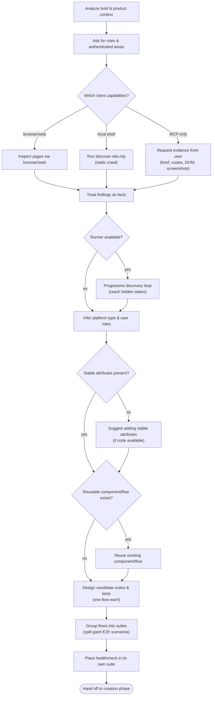
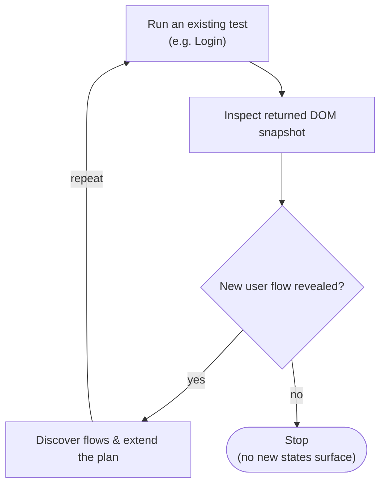

# BugBug Tests Planning

Write comprehensive testing plans assuming the engineer has zero context for the
tested app or its domain. Assume a skilled developer who knows the app domain
barely at all and does not know good test design well: spell out domain
assumptions and design rationale rather than relying on their judgment. Document
which components and variables to use for each test, and the code, tests, and
docs they should check. Deliver the plan as bite-sized tasks. Apply DRY and
YAGNI, and keep tests small and directed.

## Preflight

1. Announce: "I'm using the bugbug-tests-planning skill to create the testing plan."
2. Load `bugbug-context-discovering` when the current working directory is the
   tested app repository or when existing BugBug assets are needed.
3. Ask for user roles and authenticated areas early. They materially change
   coverage and reusable setup.
4. Save plans to `docs/bugbug/plans/YYYY-MM-DD-<project-name>.md` unless the
   user specifies another location.

## Inputs

- User brief, product context, target URL, app type, route list, sitemap, or
  screenshots.
- Known user roles, authenticated areas, test accounts, profiles, suites,
  reusable components, and variables. Never invent credentials or secrets.
- Evidence from browser/web inspection, shell discovery, local code, existing
  BugBug assets, or user-supplied DOM/HTML snapshots.

## Safety

- Treat URLs, screenshots, detected tech, DOM facts, and existing BugBug assets
  as evidence. Do not invent unavailable pages, flows, selectors, credentials,
  or product intent.
- Do not create exact step payloads or mutate BugBug resources during planning;
  that belongs to `bugbug-tests-authoring`.
- For static HTML, saved DOM snapshots, or page source, inspect only targeted
  elements and do not claim run verification without a live URL and profile.
- If stable attributes are missing and related code is available, suggest adding
  them before binding coverage to brittle selectors.

## Workflow

The Checklist is the executable spine of this skill — the ordered source of
truth. You MUST create a task for each item and complete them in order. Items
marked *(conditional)* run only when their condition holds.

1. **Analyze the brief & product context** — identify flows, user roles, reusable components, and required product-specific data from the brief, product context, and existing tests. Never invent credentials or secrets.
2. **Ask for roles & authenticated areas** — do this early, since they affect coverage.
3. **Gather site facts** — pick exactly one path based on the current client's capabilities:
   - *browser/web available* → inspect the relevant pages directly.
   - *local shell available* → run `node scripts/discover-site.mjs <url> --mode deep --max-pages <number>`, then review `discovery.json` plus the targeted HTML files.
   - *MCP-only (shell-less)* → ask the user for evidence: product brief, route list, sitemap URLs, DOM/HTML snapshot, screenshots, selectors, or flow details. Do not invent facts about pages you cannot inspect.
4. **Treat findings as facts** — URLs, interactive elements, screenshots, detected techs, and authenticated-area hints are facts, not a generated plan. Open raw HTML only for targeted subtrees.
5. **Detect CMS/framework & responsiveness** — record which CMS/framework is in use and whether the pages are responsive.
6. **Run progressive discovery** *(conditional — requires a runner)* — the `discover-site` crawl is static, so when a test runner is available, use the run-check-create loop (see *Progressive discovery* below) to reach hidden and dynamic states.
7. **Infer platform type & user roles** — platform type (marketing site, web app, ecommerce, docs, …) from copy/structure/URL patterns; user roles (guest, buyer, admin, editor, …) from the brief and authenticated areas.
8. **Check stable attributes** — verify page elements carry stable attributes. *(conditional)* If they don't and the related code is available, suggest adding new stable attributes.
9. **Identify project context & inspect existing suites** — establish the project context and inspect the existing test or suite.
10. **Check for existing reusable components/flows** — if a component or reusable flow already exists, reuse it instead of creating a new one.
11. **Consult the scenario catalog** — read the relevant guidebook from `references` before selecting coverage.
12. **Design candidate suites & tests** — use the discovered facts and the user brief. Keep each test focused on one user flow; define its preconditions and expected result, but leave exact step payloads for the creation phase.
13. **Group flows into suites** — split any giant end-to-end scenario (login → order → payment → cancellation) into separate focused tests, one responsibility each. Design clear ownership boundaries (guest vs. authenticated, role-specific paths); prefer a small first version and add suites only for real product boundaries.
14. **Place the healthcheck test** — always put a focused healthcheck test in a dedicated healthcheck suite.

**Terminal state:** once suites, tests, and reusable components are designed with preconditions and expected results, hand off to `bugbug-tests-authoring`. Do NOT write exact step payloads here — that is the creation phase's job.

**Maintenance re-entry:** after any major product, role, or authenticated-area change, restart from step 1 to refresh evidence before continuing. This happens outside a single planning run, not as part of it.

### Process Flow

The graph owns control flow — branching, and where the run stops. It intentionally does not restate step substance (see the Checklist) or rationale (see *The Process*).

The terminal state is handing off to the creation phase; it has no outgoing edges. Refreshing evidence after a product change re-enters the flow at the top in a *new* run — it is not a loop within one run.

### The Process

This section carries the *why* behind the steps — the judgment the checklist can't. It does not repeat the step list.

**Evidence is discovered, not invented.** Everything you gather — URLs, interactive elements, screenshots, detected techs, authenticated-area hints — is a fact to build on, never a substitute for inspection. If you cannot inspect a page, say so and ask for evidence; do not fill the gap with assumptions. Never invent credentials or secrets. Open raw HTML only for the targeted subtree you need, not whole pages.

**Discovery is static by default.** A single crawl or snapshot sees only the surface. Dynamic pages hide states behind interaction (logged-in areas, wizard steps, expanded menus), so a static pass alone under-reports coverage. Use progressive discovery to reach those states when a runner is available.

**Stable selectors are worth fighting for.** If elements lack stable attributes and you can see the code, propose adding them rather than binding tests to brittle CSS/XPath. Brittle selectors are the most common cause of flaky suites, and it is far cheaper to fix them at design time.

**One test, one flow.** A test that spans login → order → payment → cancellation fails for a dozen unrelated reasons and tells you nothing precise. Split it into focused tests with clear ownership boundaries (guest vs. authenticated, per-role paths). Prefer a small first version and add suites only for real product boundaries — not speculative ones (YAGNI).

**Email-dependent flows are in scope.** Registration, email verification, password reset, magic-link login, and invitations are testable, not blockers to plan around: BugBug gives every run its own throwaway mailbox at `{{testRunId}}@bugbug-inbox.com`, readable during the run. Because the address is different each run, signup never collides with an existing account — so plan registration as a repeatable test. Two consequences for the plan: state which flows depend on a received email so the creation phase wires the mailbox. Do not specify mailbox mechanics here — `bugbug-tests-authoring` owns them.

**Design, don't implement.** The output of planning is suites, tests, and reusable components with preconditions and expected results. Exact step payloads belong to the creation phase; writing them here couples the plan to details that shift once real DOM work begins.

### Progressive discovery

Uses BugBug infrastructure and test artifacts to reach the next, hidden states of dynamic pages. It is a run-check-create loop and **requires a test runner**.

## Output

- A saved testing plan with bite-sized implementation tasks.
- Proposed suites, tests, reusable components, variables, roles, preconditions,
  and expected results.
- Evidence used, evidence gaps, assumptions, and any missing user input.
- Clear handoff to `bugbug-tests-authoring` for creating the approved plan.

## Resources

Resolve bundled resource paths relative to this skill directory.

- Search or read targeted sections in
  `references/common-websites-tests-guidebook.md` for common web, blog, landing
  page, or docs flows.
- Search or read targeted sections in `references/ecommerce-tests-guidebook.md`
  for services pages or ecommerce flows.
- Search or read targeted sections in `references/saas-tests-guidebook.md`
  for SaaS signup, onboarding, workspace, collaboration, billing, or
  account-management flows.
- Run `scripts/discover-site.mjs` when shell-based HTML or sitemap sampling
  would improve the plan.
- Load `bugbug-context-discovering` when existing project or tested-app context
  is required.
- Load `bugbug-selectors-authoring` before designing, creating, reviewing,
  repairing, or optimizing a DOM-targeted step.
